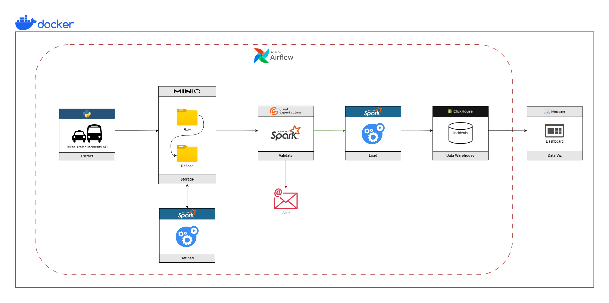
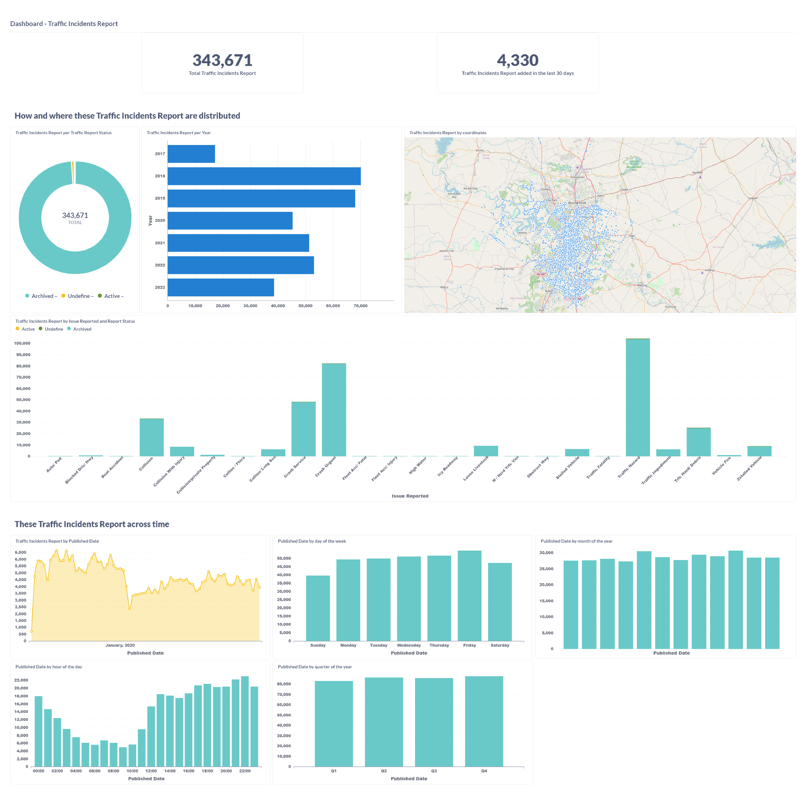

# Texas Traffic Incidents Pipeline

## Overview 

This project is based on Texas traffic incident data, this data is made available by the Texas government and is updated in real time.

The following tools were used for this project:

- Airflow
- Python
- Clickhouse
- Great Expectation
- Apache Spark
- Minio
- Docker
- Metabase

This pipeline is for batch processing, the idea is to run it once a day and create an analysis using a dashboard for visual illustration.

---

## Architecture & Workflow

To illustrate how this pipeline works, below is a workflow diagram.




First, the traffic incident API is extracted, where Python is used with the request and minio structures to load the data to the raw layer in minio storage.

With the data in the raw layer, PySpark is used to read and refine the data. The transformed data is loaded into the refined minio layer.

The next step is to validate the data to check if there are any inconsistencies, for this the Great Expectation framework is used, this step reads the refined data and applies some rules to validate the data. If there is any inconsistency, an alert email is sent to those responsible, otherwise, the data is loaded into the data warehouse.

Clickhouse is used for data storage, is a column-oriented SQL database management system, and is a high-performance service for OLAP processing.

Finally, to visualize the data, the Metabase service is used, it is a simple solution to illustrate and analyze the data.

Below is an example of a panel created in Metabase:


All these services are running on Docker.

## How to use ? 

The first step is create docker images to the airflow and metabase and configure the environment variables, to do this use the following command:

```Bash
    # Execute the command into the terminal.
    ./docker_build.sh
```

After creating the images, enter the **docker folder** and run the command:

```bash
    docker-compuse -up
```

Now, open your browser and access the following addresses:

* Airflow:  http://127.0.0.1:8080
* Minio:    http://127.0.0.1:4555
* Metabase: http://127.0.0.1:3000

In Minio it is necessary to create the access key and secret key to access this service via SDK, for this read this [documentation](https://min.io/docs/minio/container/administration/console/security-and-access.html#access-keys) to find out how to create.

After created the access for Minio, in Airflow it is necessary to create some variables with the access credentials for clickhouse and minio storage, and create the connection with the Spark cluster.

Read this [documentation](https://airflow.apache.org/docs/apache-airflow/stable/howto/variable.html) to learn how to set airflow credentials, and read this [documentation](https://airflow.apache.org/docs/apache-airflow/stable/howto/connection.html#uri-format) to learn how set airflow connection.

Variables must have the following names:

- acces_key
- secret_key
- bucket
- clickhouse_host

Connection must have the following configs:

- Id - spark_default
- Host - spark://spark-incidents
- Port - 7077


Finally, after configuring the settings, simply run Airflow Dag, and access the metabase to perform data exploration.


To see the validation document and the applied validation rules, simply enter the folder (**src/great_expectations/uncommitted/data_docs/local_site/index.html**) and open the index file in your browser. This is a sample of what you can see:


---

**Data source:** https://data.austintexas.gov/Transportation-and-Mobility/Real-Time-Traffic-Incident-Reports/dx9v-zd7x<br>
**Created at:** 29/09/2023
